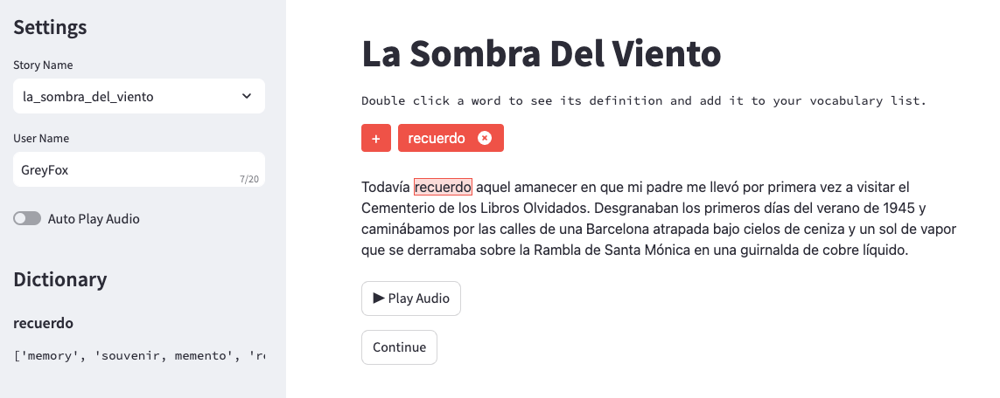

[](https://cs6460-omscs-project.streamlit.app/)

# GRALE
### Graded Reading through an Adaptive Language Environment

[]


### How to run it on your own machine

1. Install the requirements

   ```
   $ pip install -r requirements.txt
   ```

2. Run the app

   ```
   $ streamlit run streamlit_app.py
   ```
